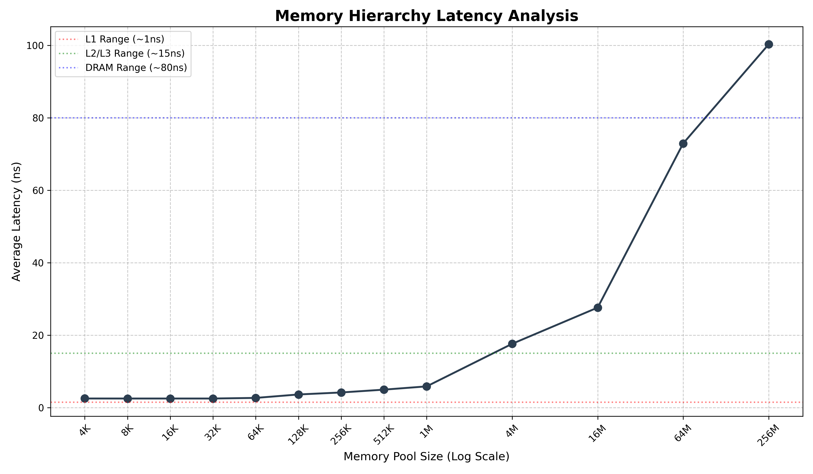

## Compile & Execute
* Compile option -O3 required, to prevent loop overhead to distort the result
* save result to data.txt 
* dataviz
    ```bash
    g++ -O3 cache_bench.cc -o cache_bench
    ./cache_bench > data.txt
    python3 log_graph.py

## example result: CPU

* **Model:** Intel(R) Xeon(R) Silver 4514Y (Sapphire Rapids)
* **Microarchitecture:** Golden Cove / Raptor Cove
* **Clock Speed:** Base 2.0GHz / Max 3.4GHz
* **Cache Hierarchy (Per Core/Socket):**
    * **L1 Cache:** 80 KB per core (32KB I + 48KB D)
    * **L2 Cache:** 2 MB per core
    * **L3 Cache:** 30 MB (Shared)